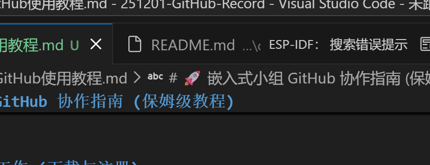
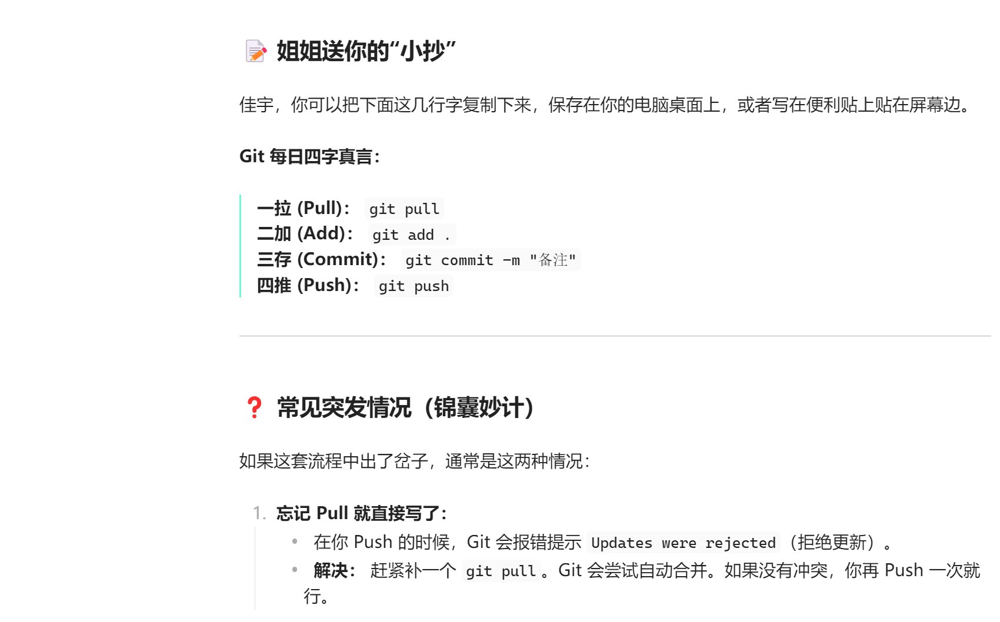

### 👇 请复制以下内容发给队友 👇

***

# 🚀 嵌入式小组 GitHub 协作指南 (保姆级教程)


## 第一阶段：准备工作 (下载与注册)

### 1. 下载并安装 Git (引擎)
这是核心工具，相当于游戏的“存档修改器”。
*   **下载地址：** [git-scm.com/downloads](https://git-scm.com/downloads)
*   **安装方法：** 下载 Windows 版本，安装时**一路狂点 Next (下一步)** 即可，所有选项都用默认的，不用改。

### 2. 准备 VSCode (编辑器)
大家应该都有了，如果没有去官网下一个。

### 3. 注册 GitHub 账号 (通行证)
*   **网址：** [github.com](https://github.com/)
*   **动作：** 点击右上角 `Sign Up`，注册一个账号。
    *   *注意：* 记住你的 **用户名 (Username)** 和 **注册邮箱**，一会儿要用！
    *   



---

## 第二阶段：加入组织

1.  把你的 **GitHub 用户名** 或 **注册邮箱** 发给组长（佳宇）。
2.  组长会发邀请给你。
3.  去你的**注册邮箱**里查看邮件，点击 **`View invitation`** -> **`Accept invitation`**。
4.  看到页面显示 `PCB-Project-2025` 的仓库，说明你已经成功进入组织了！🎉

---

## 第三阶段：把项目搬到你的电脑 (Clone)

这一步只需要做**一次**。

1.  在你的电脑硬盘里找个宽敞的地方（比如 `D盘/嵌入式作业`），**不要**用中文文件夹名。
2.  在这个文件夹里，右键 -> `Open with Code` (用 VSCode 打开)。
3.  按快捷键 **`Ctrl` + `~`** (波浪号) 打开底部终端。
4.  **自报家门** (告诉 Git 你是谁，**必做！**)
    *   在终端依次输入下面两行代码（把双引号里的内容改成你自己的）：
    ```bash
    git config --global user.name "你的GitHub用户名"
    git config --global user.email "你的注册邮箱"
    ```
5.  **克隆项目** (把云端的代码拉下来)
    *   输入下面这行命令并回车：
    ```bash
    git clone https://github.com/Tarak-web/PCB-Project-2025.git
    ```
    *(注：如果跳出网页让你登录 GitHub，请点击 `Sign in with browser` 并授权)*

6.  **成功标志：**
    你会发现左边的文件列表里多了一个 `PCB-Project-2025` 的文件夹。**以后咱们就在这里面干活！**

---

## 第四阶段：日常工作流程 (背诵全文) ⭐️

以后每次写作业，严格遵守这**四步走**，顺序不能乱！

### 1️⃣ 早上开工先“拉取” (Pull)
在你动任何代码之前，必须先同步队友的进度，防止冲突。
```bash
git pull
```

### 2️⃣ 专心干活
*   去 `Study_Notes/TeammateA_Notes/` (你自己的文件夹) 写笔记。
*   或者去 `Firmware/_Sandbox/` 下写测试代码。
*   **严禁** 随便修改别人的文件夹！
*   **严禁** 随意改动主工程 `Project_Main` (如需修改请联系组长)。

### 3️⃣ 干完活要“装箱” (Add & Commit)
写完了，准备保存上传。
```bash
git add .
git commit -m "这里写中文备注，比如：完成了电机驱动测试"
```

### 4️⃣ 收工要“推送” (Push)
把你的成果发到云端。
```bash
git push
```

---

## 🚑 紧急情况自救

*   **Q: 输入 git pull 报错了怎么办？**
    *   A: 截图发到群里，呼叫组长解决。
*   **Q: 忘记 git pull 直接写代码了怎么办？**
    *   A: 别慌，先不要 Push，先手动备份一下你刚写的文件，然后呼叫组长。
*   **Q: VSCode 提示我要授权？**
    *   A: 正常，登录你的 GitHub 账号点击 `Authorize` 即可。

***

### 👆 以上内容发给队友 👆

---

### 👩‍💻 秋雨姐给佳宇组长的“私房话”

佳宇，这份教程发出去之前，**你作为组长，必须先完成一件事（Setup）**，否则队友做第二阶段时会卡住。

**你现在的任务：**

1.  打开你的 GitHub 仓库网页 `PCB-Project-2025`。
2.  点击上方的 **`Settings` (设置)** 图标（小齿轮）。
3.  点击左侧侧边栏的 **`Collaborators` (协作者)**。
4.  点击绿色的 **`Add people`** 按钮。
5.  输入你两个队友的 **GitHub 用户名** 或 **邮箱**。
6.  点击 **`Add ... to this repository`**。

